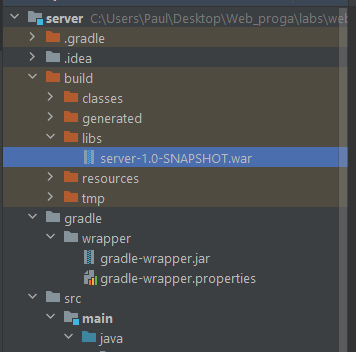

План действий:
-- Backend
1. Создать проект gradle  (скрин как создать проект gradle)
2. Потом нужно скопировать только build.gradle и заменить свой build на билд Максима
3. переименуй свою директорию на подсвеченную 
4. Скопируй содержимое директории com.web.server.demo и помести это в свою директорию под тем же названием, удали класс 
Main в своём проекте(не обращай внимания на org, там com должен быть): 
5. Скопируй всё содержимое директории resources Максима в свою resources
6. После этого должно запуститься gradle build в терминале идеи 
7. Теперь запусти в терминале команду gradle war для того, чтобы собрать war с сервером 

-- Frontend:
1. Создание проекта на vite: для начала нужно vite скачать, ты справишься. После чего нужно открыть командную строку powershell,
перейти в директорию проекта, в моём случае web4_n и проделать все действия которые есть на скрине и подсвечены. 
Появится такая структура: 
2. Потом нужно потыкаться везде и где нужно, нажимать npm install 
3. Далее в своём проекте в директории client ты удаляешь директорию src и копируешь её из проекта Максима тоже из client
4. Как скопируешь, походи по всем файлам и поустанаваливай зависимости как на фото именно туда, где я подсветил:  
5. Заходишь в директорию /client через idea или powershell и пишеть -   npm run dev
Запустится вебсервер vite, там будет показан адрес, тыкни на него [img_12.png](img_12.png)
6. Победа чёрт возьми! 

-- Wildfly:
1. С ним надо будет помучиться, Максим не помнит версию, ещё нужно решить проблемы с датасурсами, Максим сказал, что 
он их вшивал в wildfly конфигурацию, сказал, что ты знаешь, как это делать, аналогично 3 лабе по вебу.
2. По поводу изменений конфигурации wildfly, датасурс это единственное, что нужно поменять, все порты стандарт 8080, поэтому
на них забей

-- Запуск всего этого:
1. gradle build - это если ты что-то меняла на сервере
2. gradle war - создание вариника
3. copy server/build/libs/server-1.0-SNAPSHOT.war wildfly/standalone/deployments/server.war
   .\wildfly\bin\standalone
    Эта хрень запускает сервак на wildfly порт localhost:8080
Удачи!

